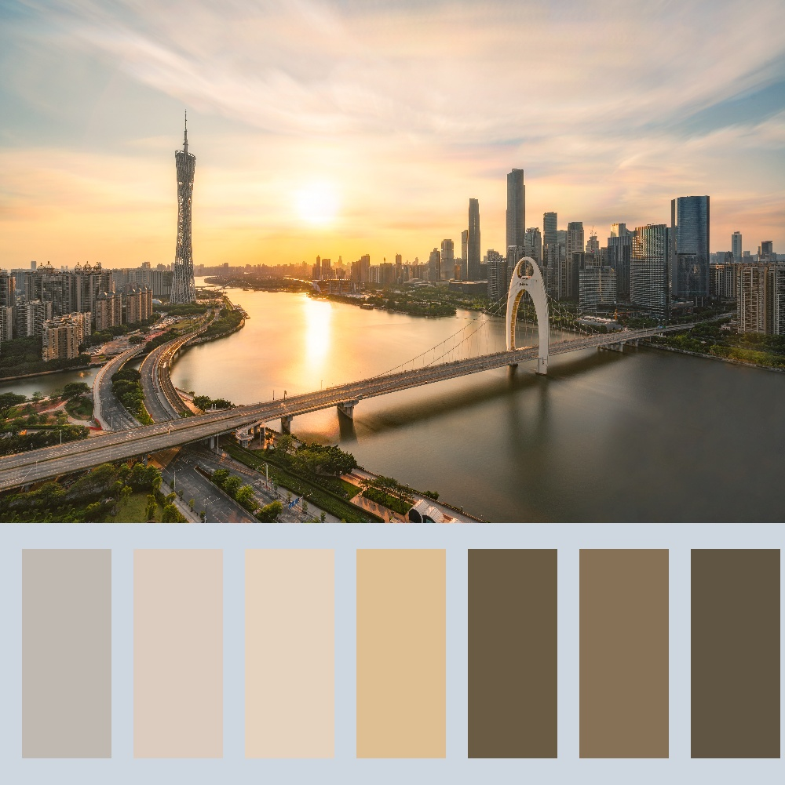

# Color Palette Generator

## Introduction

Color Palette is a way of showing the most prominent colors in a picture visually. This piece of code could automatically generate a color palette from given photography both in portrait and landscape mode. 

Some examples of color palettes are below. 

The code is implemented in Python with the following packages installed. 

- Dependnecies 
  - [NumPy](https://numpy.org/) 
  - [cv2](https://opencv.org/) 
  - [matplotlib](https://matplotlib.org/) 

## How to Use

- Open `color palette.ipynb` Jupiter notebook and check if all the dependencies are installed by running the first block of code. 
- Adjust the parameters in the second block 
  - `size`: this parameter controls the size of the shortest edge in pixels 
  - `bg`: this parameter controls the background color in RGB color code 
- Put all the pictures for color palette generation into the `src` folder 
- Run the rest of the program 
- Your color palette will be in the `product` folder 

## Possible Improvement

Currently, the program is not very efficient, so the final image size is limited to about 1000 pixels on the shortest edge. 