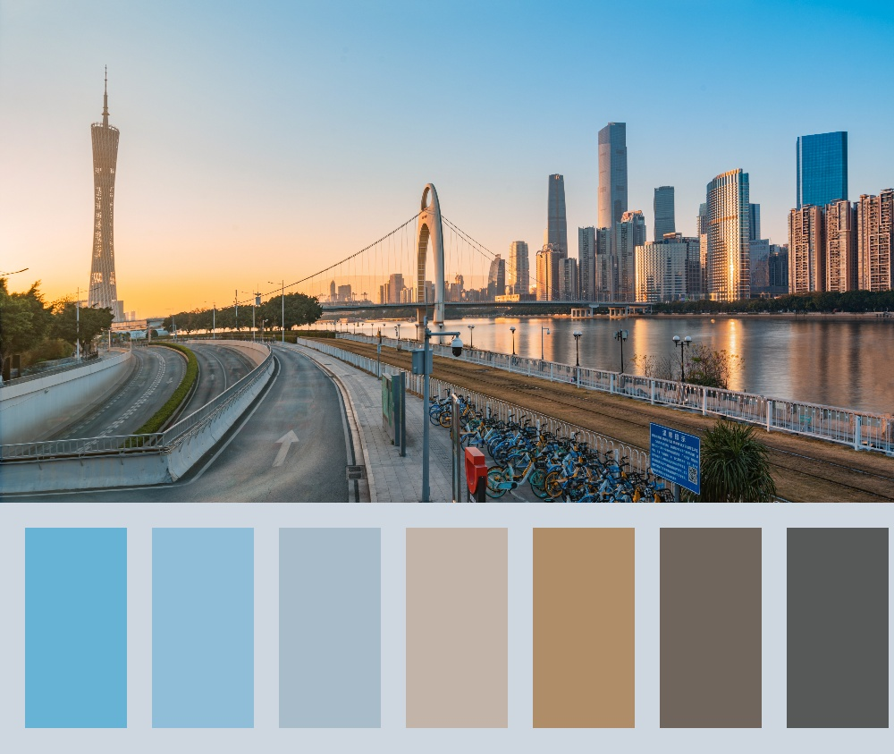
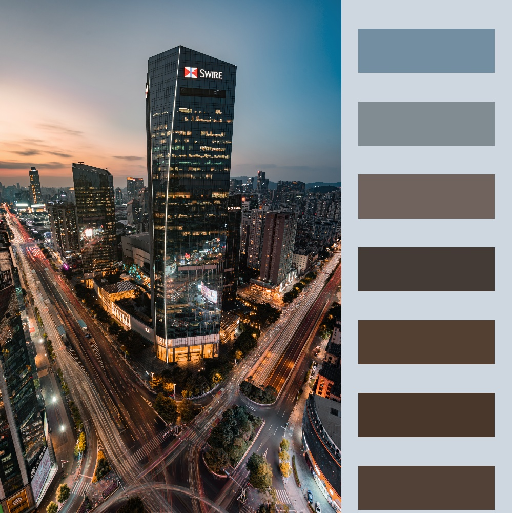

# 色卡制作 Color Palette Generator

色卡是一张照片总体颜色的体现。最近色卡风靡摄影圈，然而实现起来确是非常简单的。本程序用 Python 写成。主要用到 OpenCv。

举个例子。

- Dependencies: 
  - numpy
  - cv2 
  - matplotlib.pyplot

都是非常常用的 packages。

## How to Use

首先打开 `color palette `  jupyter notebook 并检查 dependencies。然后把想要生成色卡的图片丢进 `src`  文件夹，逐行运行。程序成功运行以后，你的色卡会放在 `product` 文件夹里面。非常方便啦。

第二个 block 里面有一些可以调整的参数，可以按自己喜好调整。

## Possible Improvement

未来要优化的是 complexity， 这个程序现在非常慢。在顶配 mbp 上跑都只能勉强维持 短边 1000 px 左右的计算量。以后有时间可以看一下优化问题。

